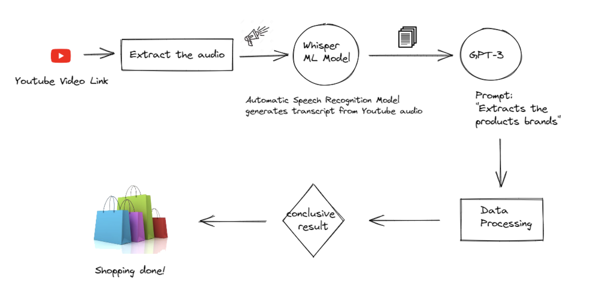

#VIDEOSHOP

VidoeShop is an integrated tool that displays beauty and cosmetic products from a youtube video. 

It is built with flask and uses openai and whisper ml model followed by further data processing.

You need to get an APIKey from openai and save it as "OPENAI_API_KEY" in a .env file to get started
And you also need another APIKEy from Google Search Engine Results API and save it in "GOOGLE_SEARCH_API" in the same.env

To run the code:

*Start virtualenvironment*

python3 -m venv venv

source venv/bin/activate

*Install the required modules*

pip install -r requirements.txt

*Run Flask*

Flask run

You should be able see the website: http://127.0.0.1:5000/

Further Fixes:

- The code broke while we were refactoring it so the json file isn't getting parsed into the jinja template our first fix if we had more time would've been to debug and fix that.
